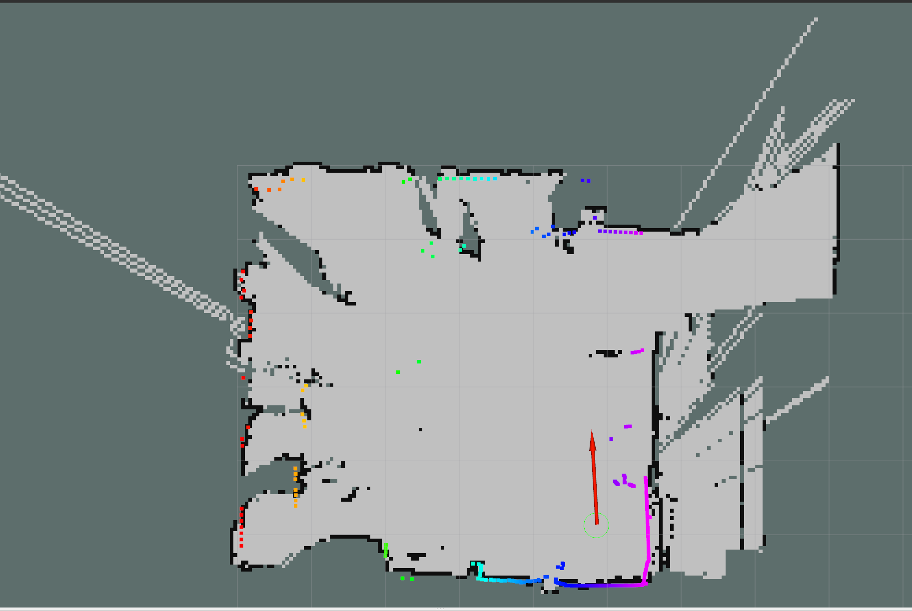

# Unitree-hrl
Unitree Go1 Repository for HRL (Bonn)

# Network setup

## Connecting to the UniTree-Go
- The Unitree-GO1 has four boards. Please refer [Unitree-docs](https://www.docs.quadruped.de/projects/go1/html/quick_start.html#network-setup)
- We will connect to the nano (Body) to access the `/scan` topic.
- Connect using `ssh -X 192.168.123.15`
- Once logged in, type `rostopic list`
```console
/cmd_vel
/map
/move_base/cancel
/move_base/feedback
/move_base/goal
/move_base/result
/move_base/status
/move_base_simple/goal
/odom
/rosout
/rosout_agg
/scan
/slam_planner_node/DBLocalPlannerROS/global_plan
/slam_planner_node/DBLocalPlannerROS/local_plan
/slam_planner_node/DBLocalPlannerROS/obstacles
/slam_planner_node/DBLocalPlannerROS/parameter_descriptions
/slam_planner_node/DBLocalPlannerROS/parameter_updates
/slam_planner_node/DBLocalPlannerROS/teb_feedback
/slam_planner_node/DBLocalPlannerROS/teb_markers
/slam_planner_node/DBLocalPlannerROS/teb_poses
/slam_planner_node/DBLocalPlannerROS/via_points
/slam_planner_node/GlobalPlanner/parameter_descriptions
/slam_planner_node/GlobalPlanner/parameter_updates
/slam_planner_node/GlobalPlanner/plan
/slam_planner_node/GlobalPlanner/potential
/slam_planner_node/current_goal
/slam_planner_node/global_costmap/costmap
/slam_planner_node/global_costmap/costmap_updates
/slam_planner_node/global_costmap/footprint
/slam_planner_node/global_costmap/inflation_layer/parameter_descriptions
/slam_planner_node/global_costmap/inflation_layer/parameter_updates
/slam_planner_node/global_costmap/obstacle_layer/clearing_endpoints
/slam_planner_node/global_costmap/obstacle_layer/parameter_descriptions
/slam_planner_node/global_costmap/obstacle_layer/parameter_updates
/slam_planner_node/global_costmap/parameter_descriptions
/slam_planner_node/global_costmap/parameter_updates
/slam_planner_node/global_costmap/static_layer/parameter_descriptions
/slam_planner_node/global_costmap/static_layer/parameter_updates
/slam_planner_node/local_costmap/costmap
/slam_planner_node/local_costmap/costmap_updates
/slam_planner_node/local_costmap/footprint
/slam_planner_node/local_costmap/obstacle_layer/parameter_descriptions
/slam_planner_node/local_costmap/obstacle_layer/parameter_updates
/slam_planner_node/local_costmap/parameter_descriptions
/slam_planner_node/local_costmap/parameter_updates
/slam_planner_node/local_costmap/static_layer/parameter_descriptions
/slam_planner_node/local_costmap/static_layer/parameter_updates
/slam_planner_node/parameter_descriptions
/slam_planner_node/parameter_updates
/slamware_ros_sdk_server_node/add_line
/slamware_ros_sdk_server_node/add_lines
/slamware_ros_sdk_server_node/basic_sensors_info
/slamware_ros_sdk_server_node/basic_sensors_values
/slamware_ros_sdk_server_node/cancel_action
/slamware_ros_sdk_server_node/clear_lines
/slamware_ros_sdk_server_node/clear_map
/slamware_ros_sdk_server_node/global_plan_path
/slamware_ros_sdk_server_node/go_home
/slamware_ros_sdk_server_node/map_metadata
/slamware_ros_sdk_server_node/move_by_direction
/slamware_ros_sdk_server_node/move_by_theta
/slamware_ros_sdk_server_node/move_line
/slamware_ros_sdk_server_node/move_lines
/slamware_ros_sdk_server_node/move_to
/slamware_ros_sdk_server_node/move_to_locations
/slamware_ros_sdk_server_node/recover_localization
/slamware_ros_sdk_server_node/remove_line
/slamware_ros_sdk_server_node/robot_basic_state
/slamware_ros_sdk_server_node/robot_device_info
/slamware_ros_sdk_server_node/rotate
/slamware_ros_sdk_server_node/rotate_to
/slamware_ros_sdk_server_node/set_map_localization
/slamware_ros_sdk_server_node/set_map_update
/slamware_ros_sdk_server_node/set_pose
/slamware_ros_sdk_server_node/sync_map
/slamware_ros_sdk_server_node/virtual_tracks
/slamware_ros_sdk_server_node/virtual_walls
/tf
/tf_static
```

## Set the host defination in both the machine (Host and Unitree-Go)

- Edit the `/etc/hosts` file in your machine. Add the following line
- `192.168.12.15 nx`

## To visualize the `/scan` topic

- Export the rosmaster to the robot
`export ROS_MASTER_URI=http://192.168.123.15:11311/`
`export ROS_IP=<your ip address>`

- Open rviz `rosrun rviz`
- Add the LaserScan topic in the panel.




- The perception module consists of RPlidar-S1-360. Please refer [Ros Package](https://github.com/Slamtec/rplidar_ros)